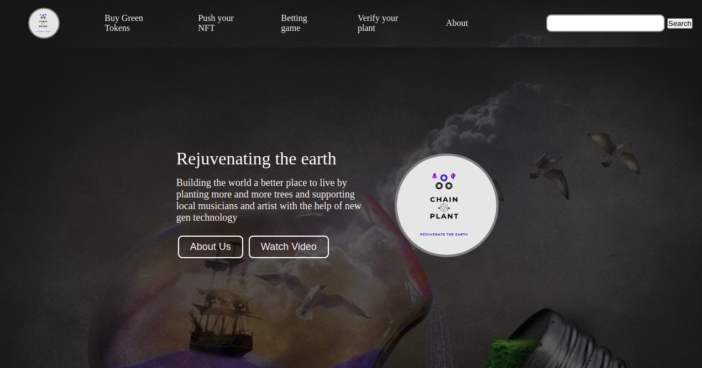
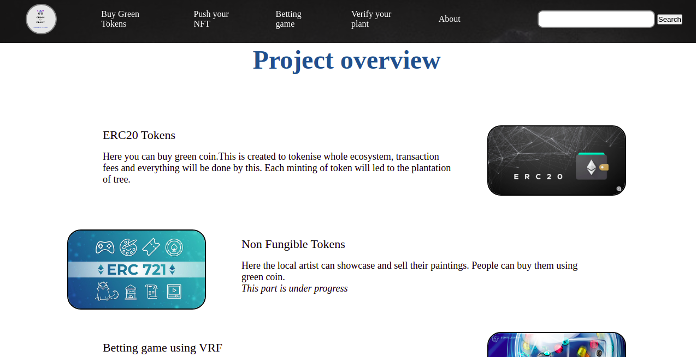
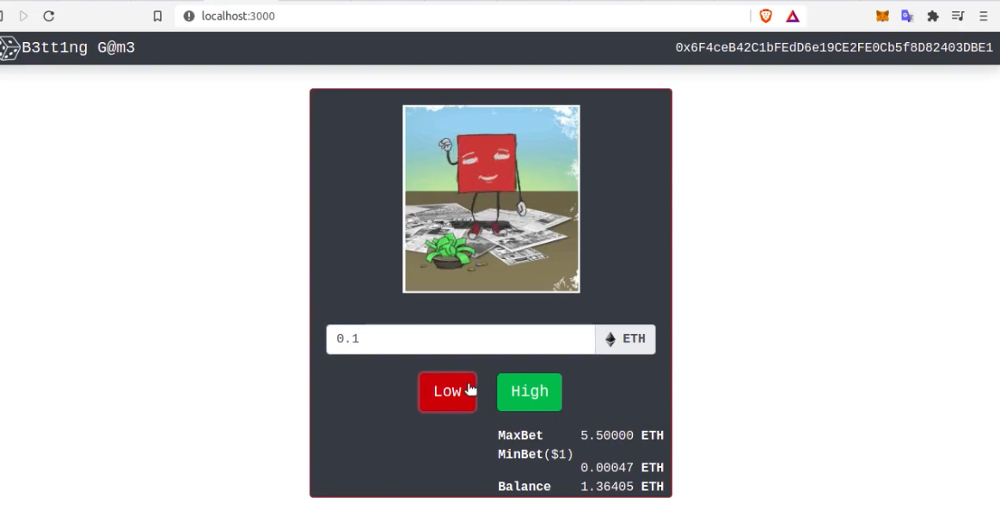
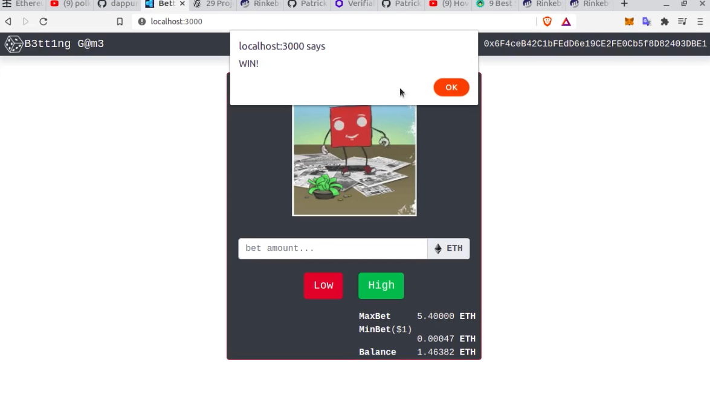

# Chainlink Truffle Box

 

 

## Requirements

- NPM

## Installation

## TODO

- Add tests for ChainlinkVRF
- Add tests for Chainlink Price Feeds
- Refactor tests to use this instead of defining contracts with let
- Use the Chainlink-published mocks for [MockV3Aggregator](https://github.com/smartcontractkit/chainlink/blob/develop/evm-contracts/src/v0.6/tests/MockV3Aggregator.sol) and [VRFCoordinatorMock](https://github.com/smartcontractkit/chainlink/blob/develop/evm-contracts/src/v0.6/tests/VRFCoordinatorMock.sol)
